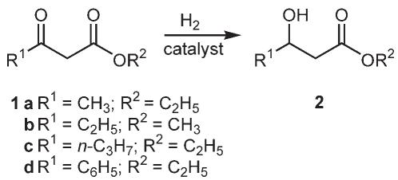
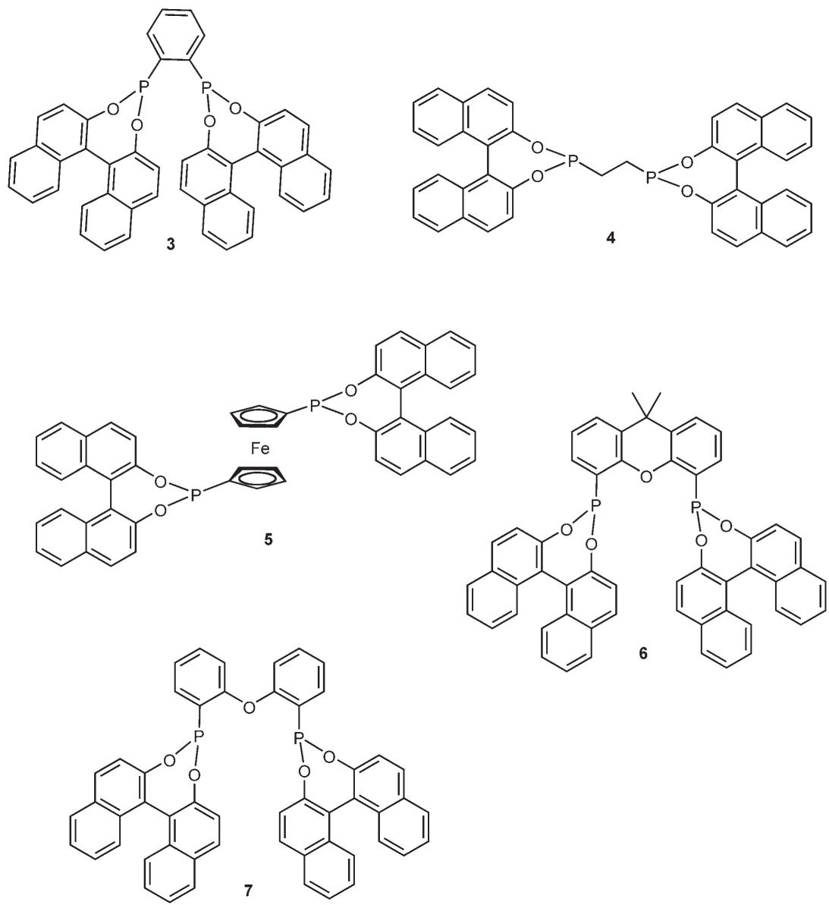
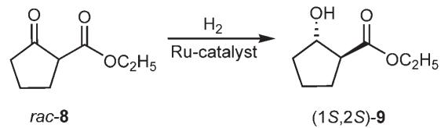
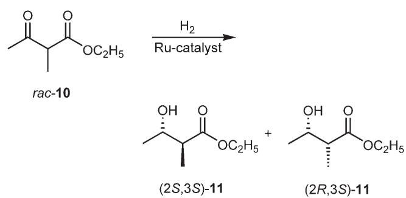

# Asymmetric Hydrogenation of b-Keto Esters Using Chiral Diphosphonites

Manfred T. Reetza,\* and Xiaoguang Lia

a Max-Planck-Institut fr Kohlenforschung, Kaiser-Wilhelm-Platz 1, 45470 Mlheim/Ruhr, Germany Fax: (+49)-208-306-2985; e-mail: reetz@mpi-muelheim.mpg.de

Received: March 10, 2006; Accepted: May 15, 2006

Abstract: The BINOL-derived diphosphonite having an achiral backbone based on diphenyl ether is a readily accessible and cheap ligand for the enantioselective Ru-catalyzed hydrogenation of b-keto esters (ee = 95–99 %).

Keywords: asymmetric catalysis; hydrogenation; keto esters; phosphonites; ruthenium

b-Hydroxy esters are useful building blocks in the synthesis of many natural products and/or biologically active compounds.[1] A particular useful synthetic strategy is the asymmetric hydrogenation of b-keto esters 1 ! 2 (Scheme 1) catalyzed by transition metal complexes of chiral phosphorus ligands.

Following the work of Noyori regarding the use of BINAP,[2] many other effective chiral diphosphines[3] have been developed for this important transformation, generally in combination with ruthenium as the transition metal. In a number of cases ees > 95 % were observed.[2, 3] More recently, research has shown that 3,3’-disubstituted BINAPO-ligands[4] and even certain chiral monodentate phosphines[5] are also well suited. In spite of these impressive results, research continues in this area, fueled by the industrial need for simple and thus readily accessible ligands.

We have previously shown that BINOL-derived diphosphonites of the types 3–7 (Figure 1) are excellent ligands in Rh-catalyzed asymmetric olefin hydrogenation,[6] Rh-catalyzed conjugate addition reactions of arylboronic acids[7] and Ru-catalyzed transfer hydrogenation of ketones.[8] In all cases studied so far, the choice of the appropriate achiral backbone is crucial. This means that in the class of BINOL-derived diphosphonites no single ligand is general. However, this is not a drawback, since the nature of the backbone can be varied readily, while using the same chiral auxiliary. BINOL in both enantiomeric forms is one of the cheapest chiral auxiliaries currently commercially available.[9]

  
Scheme 1. Asymmetric hydrogenation of b-keto esters.

Exploratory experiments were carried out with bketo ester 1a using [RuCl2(benzene)]2 and two equivalents of a BINOL-derived diphosphonite under a variety of conditions. Remarkably, four of the ligands, namely 3, 4, 5 and 6, turned out to be poor, whereas the diphosphonite 7 derived from diphenyl ether led to an enantioselectivity of ee = 95 % (Table 1). In contrast, transfer hydrogenation with ligand 7 using 2- propanol as the reductant under basic conditions turned out to be disappointing.

Ligand 7 was then tested in the Ru-catalyzed hydrogenation of the other b-keto esters (Table 2). It can be seen that following optimization of temperature and pressure, ees of 97–99 % were achieved in all cases. Here again (S,S)-7 leads to the (S)-configurated products, except in the case of the phenyl derivative 2d (due to a switch in priority within the Cahn– Ingold–Prelog nomenclature). Thus, our ligand 7 compares well with the best previous catalyst systems described thus far in the literature.[2–-5]

Finally, it was of interest to test the present catalyst system in the hydrogenation of chiral b-keto esters in racemic form under the conditions of dynamic kinetic resolution. For this purpose rac-8 was subjected to the Ru-catalyzed hydrogenation (Scheme 2) under typical reaction conditions (rac-8:Ru = 100:1; 20 h). Essentially only one product, (1S,2S)-9 having the anti-configuration was formed quantitatively (anti:syn = 96:4), the ee being 99 %. The configurational assignment was made by comparison with an authentic sample.

In contrast, upon hydrogenating rac-10 under identical conditions (Scheme 3), an equimolar mixture of the two possible diastereomers was formed [anti (2S,3S):syn (2R,3S)= 1:1], each in high enantiopurity $( e e = 9 5 \% )$

  
Figure 1. BINOL-derived diphosphonites.

Table 1. Asymmetric Ru-catalyzed hydrogenation of b-keto ester $\mathbf { 1 } \mathbf { a } . ^ { [ \mathrm { a } ] }$
<table><tr><td>Entry</td><td>Ligand</td><td>Solvent</td><td>Conversion [%]</td><td>ee [%]</td></tr><tr><td>1</td><td>3</td><td>C2H5OH/CH2Cl2 (3:1)</td><td>51</td><td>5</td></tr><tr><td>2</td><td>4</td><td>C2H5OH/CH2Cl2 (3:1)</td><td>47</td><td>8</td></tr><tr><td>3</td><td>5</td><td>C2H5OH/CH2Cl2 (3:1)</td><td>21</td><td>7</td></tr><tr><td>4</td><td>6</td><td>CH3OH/CH2Cl2 (3:1)</td><td>91</td><td>27</td></tr><tr><td>5</td><td>7</td><td>C2H5OH/CH2Cl2 (3:1)</td><td>100</td><td>95</td></tr><tr><td>6</td><td>7</td><td> $\mathrm { C _ { 2 } H _ { 5 } O H / C H _ { 2 } C l _ { 2 } }$  (1:1)</td><td>97</td><td>94</td></tr><tr><td>7</td><td>7</td><td> $\mathrm { C _ { 2 } H _ { 5 } O H / C H _ { 2 } C l _ { 2 } }$  (1:3)</td><td>97</td><td>88</td></tr><tr><td>8</td><td>7</td><td> $\mathrm { C H } _ { 2 } \mathrm { C l } _ { 2 }$ </td><td>6</td><td>71</td></tr><tr><td>9</td><td>7</td><td>THF</td><td>75</td><td>48</td></tr></table>

[a] $\mathbf { 1 a } { \mathrm { : R u } } = 1 0 0 { : } 1 { \mathrm { ; 6 0 } } ^ { \circ } \mathrm { C } ;$ 80 bar H2; 20 h. (S,S)-7 leads to (S)-2 in all cases.

All of the reactions described thus far were performed with relatively high catalyst loading (substrate:Ru = 100:1). In order to see if less catalyst can be tolerated, the hydrogenation of 1a was carried out at a 1a/Ru ratio of 1000:1 under otherwise similar conditions $[ 9 0 ^ { \circ } \mathrm { C } ;$ 50 bar H2; 20 h; C2H5OH/CH2Cl2 (3:1) as solvent]. A quantitative conversion with formation of 2a having an ee value of 93% was observed. Thus, catalyst loading can in fact be reduced by a factor of 10 without compromising enantioselectivity appreciably. However, other substrates may require optimization.

Table 2. Asymmetric Ru-catalyzed hydrogenation of b-keto esters 1 using ligand $7 . ^ { [ a ] }$
<table><tr><td>Entry</td><td>β-Keto ester</td><td>Temperature [°C]</td><td> $\mathrm { H } _ { 2 }$  pressure [bar]</td><td>Conversion [%]</td><td>ee [%]</td></tr><tr><td>1</td><td>1a</td><td>60</td><td>80</td><td>100</td><td>95</td></tr><tr><td>2</td><td>1a</td><td>85</td><td>50</td><td>97</td><td>99</td></tr><tr><td>3</td><td>1b</td><td>60</td><td>50</td><td>100</td><td>95</td></tr><tr><td>4</td><td>1b</td><td>60</td><td>80</td><td>100</td><td>95</td></tr><tr><td>5</td><td>1c</td><td>90</td><td>50</td><td>100</td><td>97</td></tr><tr><td>6</td><td>1c</td><td>60</td><td>50</td><td>100</td><td>97</td></tr><tr><td>7</td><td>1d</td><td>60</td><td>50</td><td>100</td><td>93</td></tr><tr><td>8</td><td>1d</td><td>60</td><td>80</td><td>100</td><td>93</td></tr><tr><td>9</td><td>1d</td><td>85</td><td>50</td><td>100</td><td>97</td></tr></table>

[a] 1:Ru = 100:1; solvent: C2H5OH/CH2Cl2 (3:1); 20 h.

  
Scheme 2. Ru-catalyzed hydrogenation of rac-8.

  
Scheme 3. Ru-catalyzed hydrogenation of rac-10.

In conclusion, we have developed a new catalyst system for the asymmetric hydrogenation of b-keto esters with formation of chiral b-hydroxy esters. It employs the BINOL-derived diphosphonite 7 with an achiral backbone based on diphenyl ether. Since it is easily prepared by double lithiation of diphenyl ether followed by phosphorylation and introduction of the BINOL component,[6–8] the catalyst system is industrially viable. Other BINOL-derived diphosphonites such as 3–6 are not at all suited, which demonstrates that the nature of the achiral backbone is crucial for obtaining high levels of enantioselectivity. Defining the source of enantioselectivity in the present hydrogenations and in other transition metal-catalyzed reactions[6–8] using BINOL-derived diphosphonites constitutes a goal for the future.

## Experimental Section

## General Procedure for Asymmetric Hydrogenation of b-Keto Esters

A 25 mL Schlenk tube was charged with [Ru(benzene)Cl2]2 (16 mg, 0.032 mmol) and the diphosphonite 7 (0.067 mmol). The tube was purged with argon three times before dry dimethylformamide (DMF) (3 mL) was added. The resulting mixture was heated at $1 0 0 ^ { \circ } \mathrm { C }$ for 30 min and then cooled to $6 0 ^ { \circ } \mathrm { C } .$ The solvent was removed under vacuum to provide the catalyst as a pale green-yellow solid. This catalyst was dissolved in dry dichloromethane (8 mL), and distributed equally to eight vials (1 mL each), which had already been purged with argon three times. A b-keto ester (0.8 mmol) was placed in each vial followed by addition of 3 mL ethanol. Then these eight vials were transferred to a high pressure autoclave. After purging with H2 three times, the autoclave was pressurized with $\mathrm { H } _ { 2 }$ to 60 bar and the reactions were magnetically stirred at $6 0 ^ { \circ } \mathrm { C }$ for 20 h. The autoclave was then cooled to room temperature and the $\mathrm { H } _ { 2 }$ carefully released. Samples were taken out of the reaction solution and passed through a small amount of silica gel prior to the GC analysis to determine the conversions and ee values. The conditions for enantiomer separation were those described by Knochel.[10] The absolute configuration was determined by comparison with known compounds described in the literature.

## Acknowledgements

Generous support from the Fonds der Chemischen Industrie is gratefully acknowledged.

## References

[1] S. Servi, Synthesis 1990, 1 – 25.

[2] a) R. Noyori, T. Ohkuma, M. Kitamura, H. Takaya, N. Sayo, H. Kumobayashi, S. Akutagawa, J. Am. Chem. Soc. 1987, 109, 5856 – 5858; b) M. Kitamura, T. Ohkuma, S. Inoue, N. Sayo, H. Kumobayashi, S. Akutagawa, T. Ohta, H. Takaya, R. Noyori, J. Am. Chem. Soc. 1988, 110, 629 – 631.

[3] See, for example: a) A. Hu, H. L. Ngo, W. Lin, Angew. Chem. 2004, 116, 2555 – 2558; Angew. Chem. Int. Ed. 2004, 43, 2501 – 2504; b) T. Sturm, W. Weissensteiner, F. Spindler, Adv. Synth. Catal. 2003, 345, 160 – 164; c) C.- C. Pai, C.-W. Lin, C.-C. Lin, C.-C. Chen, A. S. C. Chan, J. Am. Chem. Soc. 2000, 122, 11513 – 11514; d) T. Ireland, G. Großheimann, C. Wieser-Jeunesse, P. Knochel, Angew. Chem. 1999, 111, 3397 – 3400; Angew. Chem. Int. Ed. 1999, 38, 3212 – 3215; e) T. Yamano, N. Taya, M. Kawada, T. Huang, T. Imamoto, Tetrahedron Lett. 1999, 40, 2577 – 2580; f) P. J. Pye, K. Rossen, R. A. Reamer, R. P. Volante, P. J. Reider, Tetrahedron Lett. 1998, 39, 4441 – 4444; g) D. J. Ager, S. A. Laneman, Tetrahedron: Asymmetry 1997, 8, 3327 – 3355; h) A. Wolfson, I. F. J. Vankelecom, S. Geresh, P. A. Jacobs, J. Mol. Catal. A : Chem. 2003, 198, 39 – 45 ; i) M. J. Burk, T. G. P.

Harper, C. S. Kalberg, J. Am. Chem. Soc. 1995, 117, 4423 – 4424; j) K. Mashima, K.-H. Kusano, N. Sato, Y.-I. Matsumura, K. Nozaki, H. Kumobayashi, N. Sayo, Y. Hori, T. Ishizaki, S. Akutagawa, H. Takaya, J. Org. Chem. 1994, 59, 3064 – 3076.

[4] Y.-G. Zhou, W. Tang, W.-B. Wang, W. Li, X. Zhang, J. Am. Chem. Soc. 2002, 124, 4952 – 4953.

[5] K. Junge, B. Hagemann, S. Enthaler, G. Oehme, M. Michalik, A. Monsees, T. Riermeier, U. Dingerdissen, M. Beller, Angew. Chem. 2004, 116, 5176 – 5179; Angew. Chem. Int. Ed. 2004, 43, 5066 – 5069.

[6] a) M. T. Reetz, A. Gosberg, R. Goddard, S.-H. Kyung, Chem. Commun. (Cambridge, U. K.) 1998, 2077 – 2078; b) M. T. Reetz, A. Gosberg, World Patent WO 00/ 14096, 2000; Chem. Abstr. 2000, 132, 207957; c) M. T. Reetz, Pure Appl. Chem. 1999, 71, 1503 – 1509.

[7] M. T. Reetz, D. Moulin, A. Gosberg, Org. Lett. 2001, 3, 4083 – 4085.

[8] M. T. Reetz, X. Li, J. Am. Chem. Soc. 2006, 128, 1044 – 1045.

[9] RCA – Reuter Chemische Apparatebau KG, Freiburg, Germany and other providers.

[10] T. Ireland, K. Tappe, G. Grossheimann, P. Knochel, Chem. Eur. J. 2002, 8, 843 – 852.