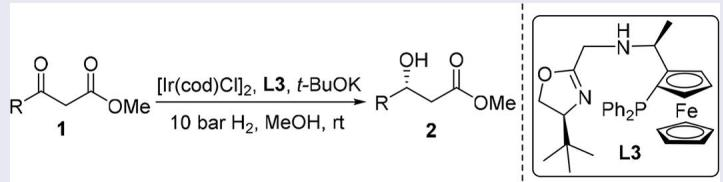
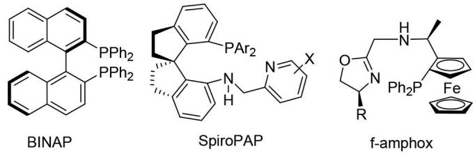
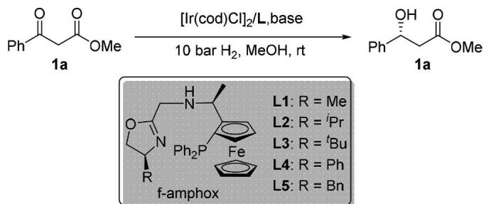

# Iridium-catalyzed asymmetric hydrogenation of β- keto esters with f-amphox ligands

Chao Qin, Xiu-Shuai Chen, Chuan-Jin Hou, Hongzhu Liu, Yan-Jun Liu, De-Zhi Huang & Xiang-Ping Hu

To cite this article: Chao Qin, Xiu-Shuai Chen, Chuan-Jin Hou, Hongzhu Liu, Yan-Jun Liu, De-Zhi Huang & Xiang-Ping Hu (2018) Iridium-catalyzed asymmetric hydrogenation of β-keto esters with f-amphox ligands, Synthetic Communications, 48:6, 672-676, DOI: 10.1080/00397911.2017.1414267

To link to this article: https://doi.org/10.1080/00397911.2017.1414267

View supplementary material

Published online: 13 Feb 2018.

Submit your article to this journal

Article views: 392

View related articles

View Crossmark data

2 Citing articles: 3 View citing articles

Check for updates

# Iridium-catalyzed asymmetric hydrogenation of β-keto esters with f-amphox ligands

Chao Qina,b , Xiu-Shuai Chena,b , Chuan-Jin Houa,c , Hongzhu Liuc , Yan-Jun Liua , De-Zhi Huanga , and Xiang-Ping Hub

a School of Light Industry and Chemical Enginerring, Dalian Polytechnic University, Dalian, China; b Dalian Institute of Chemical Physics, Chinese Academy of Sciences, Dalian, China; c Post-Doctoral Research Station of Dalian Zhenbang Fluorocarbon Paint Stock Co., Ltd., Dalian, China

## ABSTRACT

The iridium-catalyzed asymmetric hydrogenation of β-keto esters with chiral tridentate P,N,N-ligands (f-amphox) has been developed. Under the optimized conditions, a wide range of β-keto esters can be hydrogenated smoothly, affording the corresponding β-hydroxy esters in good to excellent enantioselectivities (up to 95% ee).

## GRAPHICAL ABSTRACT

ARTICLE HISTORY Received 6 November 2017

KEYWORDS

Asymmetric hydrogenation; f-amphox ligands; iridium; β-keto esters

## Introduction

Transition metal-catalyzed asymmetric hydrogenation represents one of the most efficient strategies for the synthesis of optically pure compounds,[1] in which the design and synthesis of chiral ligands is the key issue for obtaining high reactivity and enantioselectivity. In the past decades, numerous chiral ligands have been developed and successfully applied to the asymmetric hydrogenation. In 1987, Noyori et al.[2] reported the first ruthenium-catalyzed enantioselective hydrogenation of β-keto esters using BINAP (Fig. 1) as chiral ligand, yielding the chiral β-hydroxy esters, which are significant building blocks for the synthesis of biologically active compounds. Since this pioneering work, a large number of chiral diphosphine ligands such as synphos,[3] difluorphos,[4] tunephos,[5] segphos,[6] solphos,[7] P-phos,[8] PQ-phos,[9] and MeO-naphephos[10] have been developed and proved to efficient in the ruthenium-catalyzed asymmetric hydrogenation of β-keto esters. Recently, Zhou[11] reported the chiral iridium catalysts with a tridentate spiro P,N,N-ligands, SpiroPAP (Fig. 1), which showed excellent enantioselectivities and extremely high turnover number (TON) for the hydrogenation of simple ketones and β-keto esters. The exceptionally high reactivity and enantioselectivity due to the metal–ligand bifunctional mechanism involve “NH effect,” similar to the Noyori’s diphoshpine–ruthenium–diamine catalyst system. Utilizing the strategy of “NH effect,” $Z \mathrm { h a n g } ^ { [ 1 \bar { 2 } ] }$ has successfully developed a novel ferrocenyl tridentate P,N,N-ligands (f-amphox, Fig. 1) and applied them in the Ir-catalyzed asymmetric hydrogenation of various ketones with excellent enantioselectivities. Based on our research in the synthesis of chiral tridentate P,N,N-ligands and their application in asymmetric hydrogenation,[13] we envisioned that the f-amphox ligands should also be efficient in the asymmetric hydrogenation of β-keto esters. As a result, herein, we report our studies in the iridium-catalyzed asymmetric hydrogenation of β-keto esters with the f-amphox ligands, which provides the corresponding chiral β-hydroxy esters with good to excellent enantioselctivity (up to 95% ee) under mild conditions.

  
Figure 1. Examples of efficient chiral ligands in asymmetric hydrogenation.

## Results and discussion

The f-amphox ligands L1–L5 were prepared from $( S _ { \mathrm { c } } , R _ { \mathrm { p } } ) { \mathrm { - P P F N H } _ { 2 } }$ as literature reported. With these ligands on hand, we then evaluated them in the iridium-catalyzed asymmetric hydrogenation of methyl 3-oxo-3-phenylpropanoate (1a) as the model substrate with the catalyst generated in situ by mixing [Ir(cod)Cl]2 with f-amphox ligands L1–L5 in MeOH. As shown in Table 1, the f-amphox ligands displayed moderate to excellent enantioselectivity (entries 1–5). The ligand screening results demonstrated that the substituent on the oxazoline had a significant effect on the enantioselectivity. Ligand L3 with t-Bu substituent afforded the best result with 95% ee (entry 3). Subsequently, different bases were screened for this transformation catalyzed by Ir-L3 in MeOH. All the bases tested such as t-BuOK, t-BuONa, KOH, NaOH, and ${ \mathrm { K } } _ { 2 } { \mathrm { C O } } _ { 3 }$ showed good to excellent results (entries 6–9), and t-BuOK was identified as the best choice in terms of reactivity and enantioselectivity.

Encouraged by this initial result, we explored the hydrogenation of various β-keto esters to evaluate the scope and limitation of the reaction, and the results are summarized in Table 2. The results indicated that a wide range of β-keto esters 1 can be hydrogenated affording the corresponding chiral β-hydroxy esters 2 with good to excellent enantioselectivities (entries 1–8). The substrates containing different substitution patterns (ortho-, meta-, para-) at the phenyl ring were hydrogenated smoothly, regardless of the electronic properties (electron donating or electron withdrawing). In addition, 2-naphthyl substrate 1i proceeded efficiently with 88% ee (entry 9). Meanwhile, the heterocyclic substrates 1j and 1k also served well, giving the corresponding hydrogenation products with both 92% ee (entries 10–11). To our delight, the i-Pr substrate 1l also reacted smoothly to produce the corresponding β-hydroxy esters with 76% ee (entry 12). However, low enantioselectivity (32% ee) was obtained when Me substrate 1m was applied in the reaction (entry 13).

Table 1. Asymmetric hydrogenation of methyl 3-oxo-3-phenylpropanoate (1a): Optimizing reaction conditions.a  

<table><tr><td>Entry</td><td>Ligand</td><td>Base</td><td>Yield  $( \% ) ^ { b }$ </td><td>ee (%)</td></tr><tr><td>1</td><td>L1</td><td>t-BuOK</td><td>95</td><td>52</td></tr><tr><td>2</td><td>L2</td><td>t-BuOK</td><td>95</td><td>88</td></tr><tr><td>3</td><td>L3</td><td>t-BuOK</td><td>95</td><td>95</td></tr><tr><td>4</td><td>L4</td><td>t-BuOK</td><td>95</td><td>72</td></tr><tr><td>5</td><td>L5</td><td>t-BuOK</td><td>95</td><td>71</td></tr><tr><td>6</td><td>L3</td><td>t-BuONa</td><td>95</td><td>87</td></tr><tr><td>7</td><td>L3</td><td>KOH</td><td>90</td><td>94</td></tr><tr><td>8</td><td>L3</td><td>NaOH</td><td>85</td><td>95</td></tr><tr><td>9</td><td>L3</td><td> ${ \sf K } _ { 2 } { \sf C } 0 _ { 3 }$ </td><td>95</td><td>87</td></tr></table>

a Hydrogenation was performed with 0.5 mol% of [Ir(cod)Cl]2, 1.1 mol% of f-amphox ligands, and 5 mol% of bases under  
10 bar of $\mathsf { H } _ { 2 }$ at room temperature for 12 h, unless otherwise stated.  
b Isolated yield.  
c Enantiomeric excesses were determined by HPLC using a chiral stationary phase.

Table 2. Asymmetric hydrogenation of β-keto esters 1 with ${ \mathfrak { l r } } / 1 3 . ^ { a }$
<table><tr><td rowspan="2">1</td><td rowspan="2">OMe</td><td rowspan="2">[Ir(cod)Cl]2 (0.5 mol %) L3 (1.1 mol%) t-BuOK (5 mol%)</td><td rowspan="2">OH O OMe</td></tr><tr><td>10bar  $\mathsf { H } _ { 2 } ,$  MeOH, rt 2</td></tr><tr><td>Entry</td><td>Substrate</td><td>R</td><td>Yield  $( \% ) ^ { b }$  ee (%)c</td></tr><tr><td>1</td><td>1a</td><td> ${ \mathsf { C } } _ { 6 } { \mathsf { H } } _ { 5 }$ </td><td>95 95</td></tr><tr><td>2</td><td>1b</td><td> $2 \mathrm { - C l C _ { 6 } H _ { 4 } }$ </td><td>96 83</td></tr><tr><td>3</td><td>1c</td><td> $3 \mathrm { - C l C _ { 6 } H _ { 4 } }$ </td><td>91 71</td></tr><tr><td>4 5</td><td>1d</td><td> $4 { \mathrm { - } } \mathsf { C l C } _ { 6 } \mathsf { H } _ { 4 }$ </td><td>90 75 94 80</td></tr><tr><td>6 1f</td><td>1e</td><td> $4 { \cdot } \mathsf { B r C } _ { 6 } \mathsf { H } _ { 4 }$   $4 { \cdot } \mathsf { F C } _ { 6 } \mathsf { H } _ { 4 }$ </td><td>90 86</td></tr><tr><td>7 1g</td><td></td><td> $4 { \cdot } M e C _ { 6 } \mathsf { H } _ { 4 }$ </td><td>90 92</td></tr><tr><td>8 1h</td><td></td><td> $4 { \cdot } M e O C _ { 6 } { \cdot } H _ { 4 }$ </td><td>91 92</td></tr><tr><td>9 1i</td><td></td><td> $2 { \cdot } \mathsf { N a p h t h y } |$ </td><td>94 88</td></tr><tr><td>10 1j</td><td></td><td>2-Furyl</td><td>88 92</td></tr><tr><td>11 1k</td><td></td><td>2-Thienyl</td><td>93 92</td></tr><tr><td>12</td><td>1I</td><td>i-Pr</td><td>80 76</td></tr><tr><td>13</td><td>1m</td><td>Me</td><td>82 32</td></tr><tr><td></td><td></td><td></td><td></td></tr></table>

a Hydrogenation was performed with 0.5 mol% of [Ir(cod)Cl]2, 1.1 mol% of f-amphox ligands L3, and 5 mol% of t-BuOK under 10 bar of H2 at room temperature for 12 h, unless otherwise stated.  
b Isolated yield.  
c Enantiomeric excesses were determined by HPLC using a chiral stationary phase.

## Conclusion

In conclusion, we have developed a highly efficient iridium-catalyzed asymmetric hydrogenation of β-keto esters with chiral tridentate P,N,N-ligands f-amphox. The results

suggest that a wide range of β-keto esters can be hydrogenated with good to excellent enantioselectivities under the optimized conditions.

## Experimental

The hydrogenation reaction was performed in glove box by use of a stainless steel autoclave. Solvents were purified by standard procedure and commercial reagents were used without further purification. 1 HNMR spectra were recorded on a Bruker 400 MHz spectrometer. Chemical shifts are expressed in δ value (ppm) using tetramethylsilane as an internal standard. HPLC analysis was performed on an Agilent 1100 series instrument with a chiralpak AS-H, chiralcel OD-H, chiralcel AD-H, or chiralcel OJ-H column. Optical rotations were recorded on a JASCO P-1020 polarimeter. The absolute configurations of the products were determined by comparing optical rotation with the reported data.

## General procedure for asymmetric hydrogenation

In a nitrogen-filled glove box, a stainless steel autoclave was charged with $[ \mathrm { I r } ( \mathrm { c o d } ) \mathrm { C l } ] _ { 2 }$ (3.4 mg, 0.05 mmol) and $( S _ { c } , R _ { \mathrm { p } } , S _ { c } ) – \mathbf { L } 3$ (6.1 mg, 0.11 mmol) in 1.0 mL of dry MeOH. After stirring for 1 h at room temperature, a solution of the substrates 1 (1.0 mmol) and t-BuOK (5.6 mg, 0.05 mmol) in 2.0 mL of MeOH was added to the reaction mixture, and then the hydrogenation was performed at room temperature under the $\mathrm { H } _ { 2 }$ pressure of 10 bar for 12 h. The solvent was then evaporated and the residue was purified by flash column chromatography to give the corresponding hydrogenation product, which was analyzed by chiral HPLC to determine the enantiomeric excesses.

## (R)-methyl 3-hydroxy-3-phenylpropanoate 2a

Colorless oil was obtained in 95% yield. 95% ee was determined by chiral HPLC (chiralcel OD-H, n-hexane/i-PrOH ¼ 90/10, 0.8 mL/min, 210 nm, $4 0 \ ^ { \circ } \mathrm { C } )$ : $t _ { \mathrm { R } }$ (minor) ¼ 11.3 min, $t _ { \mathrm { R } }$ (major) ¼ 16.3 min. $[ \alpha ] _ { \mathrm { D } } ^ { 2 0 } = + 4 5 . 5$ (c 1.10, $\mathrm { C H } _ { 2 } \mathrm { C l } _ { 2 } )$ . 1 H NMR (400 MHz, CDCl3) δ 7.39–7.29 (m, 5H), 5.14 (dd, J ¼ 8.8, 4.0 Hz, 1H), 3.72 (s, 3H), 2.81–2.69 (m, 3H).[13b]

## Funding

The authors are grateful for the financial support from the National Natural Science Foundation of China (Nos. 21403022, 21572226, and 21772196), Natural Science Foundation of Liaoning Province of China (No. 2015020194), and program of Star of Dalian Youth Science and Technology (No. 2016RQ062).

## References

[1] For some reviews, see: (a) de Vries, J. G.; Elsevier, C. J. Handbook of Homogeneous Hydrogenation; Wiley-VCH: Weinheim, 2007; (b) Xie, J.-H.; Zhu, S.-F.; Zhou, Q.-L. Chem. Rev. 2011, 111, 1713–1760; (c) Wang, D.-S.; Chen, Q.-A.; Lu, S.-M.; Zhou, Y.-G. Chem. Rev. 2012, 112, 2557–2590; (d) Verendel, J. J.; Pamies, O.; Dieguez, M.; Andersson, P. Chem. Rev. 2013, 113, 2130–2169; (e) Zhang, Z.; Butt, N. A.; Zhang, W. Chem. Rev. 2016, 116, 14769–14827; for examples of transition metal-catalyzed asymmetric hydrogenation, see: (f) Chen, J.; Liu, D.; Butt, N.; Li, C.; Fan, D.; Liu, Y.; Zhang, W. Angew. Chem. Int. Ed. 2013, 52, 11632–11636; (g) Hu, Q.; Zhang, Z.; Liu, Y.; Imamoto, T.; Zhang, W. Angew. Chem. Int. Ed. 2015, 54, 2260–2264.

[2] Noyori, R.; Ohkuma, T.; Kitamura, M. J. Am. Chem. Soc. 1987, 109, 5856–5858.

[3] (a) de Paule, S. D.; Jeulin, S.; Ratovelomanana-Vidal, V.; Genet, J.-P.; Champion, N.; Dellis, P. Eur. J. Org. Chem. 2003, 2003, 1931–1941; (b) de Paule, S. D.; Jeulin, S.; Ratovelomanana-Vidal, V.; Genet, J.-P.; Champion, N.; Dellis, P. Proc. Natl. Acad. Sci. USA 2004, 101, 5799–5804.

[4] de Paule, S. D.; Jeulin, S.; Ratovelomanana-Vidal, V.; Genet, J.-P.; Champion, N.; Dellis, P. Angew. Chem. Int. Ed. 2004, 43, 320–325.

[5] (a) Sun, X.; Li, W.; Hou, G.; Zhou, L.; Zhang, X. Adv. Synth. Catal. 2009, 351, 2553–2557; (b) Wang, C.-J.; Wang, C.-B.; Chen, D.; Yang, D. C.; Wu Z.; Zhang, X. Tetrahedron Lett. 2009, 50, 1038–1040.

[6] Wan, X.; Sun, Y.; Luo, Y.; Li, D.; Zhang, Z. J. Org. Chem. 2005, 70, 1070–1072.

[7] (a) Wu, J.; Chen, H.; Zhou, Z.-Y.; Yeung, C. H.; Chan, A. S. C. Synthesis 2001, 2001, 1050–1054; (b) Wu, J.; Chen, H.; Kwok, W. H.; Lam, K. H.; Zhou, Z. Y.; Yeung, C. H.; Chan, A. S. C. Tetrahedron Lett. 2002, 43, 1539–1543.

[8] Kesselgruber, M.; Lotz, M.; Martin, P.; Melone, G.; Muller, M.; Pugin, B.; Naud, F.; Spindler, F.; Thommen, M.; Zbinden, P. Chem. Asian J. 2008, 3, 1384–1389.

[9] (a) Qiu, L.; Kwong, F. Y.; Wu, J.; Lam, W. H.; Chan, S.; Yu, W.-Y.; Li, Y.-M.; Guo, R.; Zhou, Z.; Chan, A. S. C. J. Am. Chem. Soc. 2006, 128, 5955–5965; (b) Qiu, L.; Wu, J.; Chan, S.; Au-Yeung, T. T.-L.; Ji, J.-X.; Guo, R.; Pai, C.-C.; Zhou, Z.; Li, X.; Fan, Q.-H. Proc. Natl. Acad. Sci. USA 2004, 101, 5815–5820.

[10] Madec, J.; Michaud, G.; Genet, J.-P.; Marinetti, A. Tetrahedron Asymmetry 2004, 15, 2253–2261.

[11] (a) Xie, J.-H.; Liu, X.-Y.; Xie, J.-B.; Wang, L.-X.; Zhou, Q.-L. Angew. Chem. Int. Ed. 2011, 50, 7329–7332; (b) Xie, J.-H.; Liu, X.-Y.; Yang, X.-H.; Xie, J.-B.; Wang, L.-X.; Zhou, Q.-L. Angew. Chem. Int. Ed. 2012, 51, 201–203; (c) Yang, X.-H.; Xie, J.-H.; Liu, W.-P.; Zhou, Q.-L. Angew. Chem. Int. Ed. 2013, 52, 7833–7836.

[12] (a) Wu, W.; Liu, S.; Duan, M.; Tan, X.; Chen, C.; Xie, Y.; Lan, Y.; Dong, X.-Q.; Zhang, X. Org. Lett. 2016, 18, 2938–2941; (b) Wu, W.; Xie, Y.; Li, P.; Li, X.; Liu, Y.; Dong, X.-Q.; Zhang, X. Org. Chem. Front. 2017, 4, 555–559; (c) Hu, Y.; Wu, W.; Dong, X.-Q.; Zhang, X. Org. Chem. Front. 2017, 4, 1499–1502.

[13] (a) Hou, C.-J.; Hu, X.-P. Org. Lett. 2016, 18, 5592–5595; (b) Chen, X.-S.; Hou, C.-J.; Qin, C.; Liu, H.; Liu, Y.-J.; Huang D.-Z.; Hu, X.-P. RSC. Adv. 2017, 7, 12871–12875.